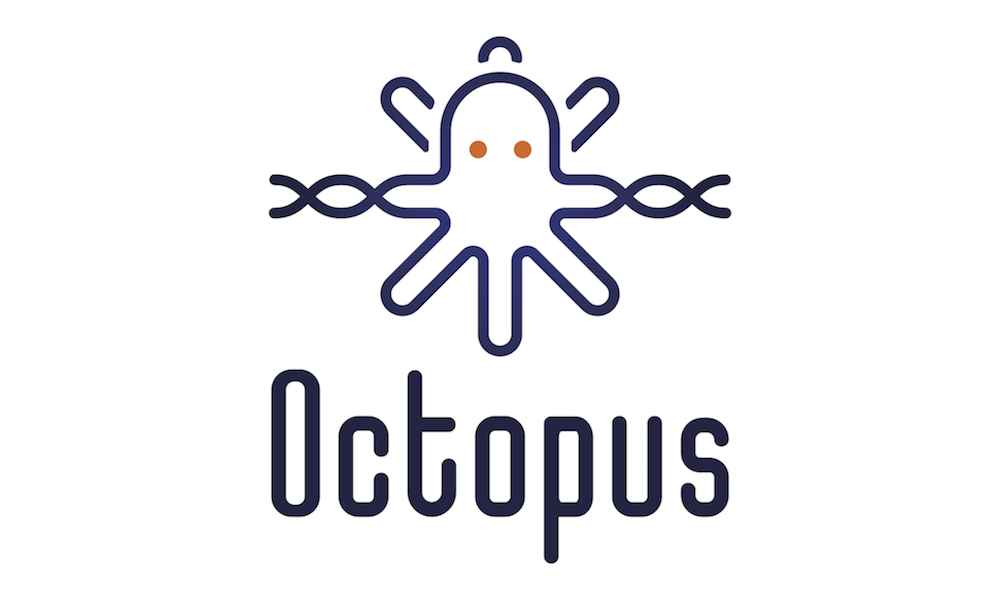

[](https://travis-ci.com/dancooke/octopus)
[](http://opensource.org/licenses/MIT)
[](https://gitter.im/octopus-caller/Lobby?utm_source=badge&utm_medium=badge&utm_campaign=pr-badge)

---

**Warning: this project is incomplete and untested - do not use it for production work.**

---

Octopus is a mapping-based variant caller that implements several calling models within a unified haplotype-aware framework. Octopus explicitly stores allele phasing which allows haplotypes to be dynamically excluded and extended whilst retaining the existing phasing information. Primarily this means Octopus can jointly consider allele sets far exceeding the cardinality of other approaches. But perhaps more importantly, this allows *marginalisation* over posterior distributions in haplotype space at specific loci. In practise this means Octopus can achieve far greater allelic genotyping accuracy than other methods, but can also infer conditional or unconditional phase probabilities directly from genotype probability distributions. This allows Octopus to report consistent allele event level variant calls *and* independent phase information.

##Requirements
* A C++14 compiler with SSE2 support
* Git 2.5 or greater
* Boost 1.61 or greater
* htslib 1.31.1 or greater
* CMake 3.3 or greater
* Optional:
    * Python3 or greater

##Installation

Octopus can be built and installed on a wide range of operating systems including most Unix based systems (Linux, OS X) and Windows.

####*Installing with Homebrew (for OS X)*

The recommended method of installation for Max OS X is with the package manager [Homebrew](http://brew.sh):

```shell
$ brew tap science
$ brew install octopus
```

This will download the relevant files (including any dependancies) and install to `usr/local/bin`. Octopus can then be easily updated or removed:

```shell
$ brew upgrade octopus
$ brew uninstall octopus
```

####*Quick installation with Python3*

Manually installing octopus requires obtaining a copy the binaries. In the command line, direct to an appropriate install directory and execute:

```shell
$ git clone https://github.com/dancooke/octopus.git
```

then use the Python3 install helper:

```shell
$ ./octopus/make.py
```

by default this installs to `/bin` relative to where you installed octopus. To intall to a root directory (e.g. `/usr/local/bin`) use:

```shell
$ ./octopus/make.py --root
```

this may prompt you to enter a `sudo` password.

####*Installing with CMake*

If Python3 isn't available, the binaries can be installed manually with [CMake](https://cmake.org):

```shell
$ git clone https://github.com/dancooke/octopus.git
$ cd octopus/build
$ cmake ..
$ make install
```

By default this installs to the `/bin` directory where octopus was installed. To install to root (e.g. `/usr/local/bin`) use the `-D` option:

```shell
$ cmake -DINSTALL_ROOT=ON ..
```

CMake will try to find a suitable compiler on your system, if you'd like you use a specific compiler use the `-D` option, for example:

```shell
$ cmake -D CMAKE_C_COMPILER=gcc-4.2 -D CMAKE_CXX_COMPILER=g++-4.2 ..
```

You can check installation was successful by executing the command:

```shell
$ octopus --help
```

##Running Tests

Octopus comes packaged with unit, regression, and benchmark testing. The unit tests are self-contained whilst the regression and benchmark tests require external data sources.

####*Running the tests with Python3*

```shell
$ ./test.py
```

####*Running tests with CMake*

```shell
$ cd build
$ cmake -DBUILD_TESTING=ON .. && make test
```

##Examples

Here are some basic examples to get started. These examples are by no means exhaustive, and users are directed to the documentation for further details.

####*Calling germline variants in an individual*

This is the simplest case, if the file `NA12878.bam` contains a single sample, octopus will default to its individual calling model:

```shell
$ octopus --reference hs37d5.fa --reads NA12878.bam
```

or less verbosly:

```shell
$ octopus -R hs37d5.fa -I NA12878.bam
```

Note octopus automatically detects the samples contained in the input read file and will jointly call all samples present by default, to restrict calling to a single sample in this case it is required to explictly specify which sample to use:

```shell
$ octopus -R hs37d5.fa -I multi-sample.bam -S NA12878
```

####*Joint variant calling*

Octopus uses different calling models for populations and individuals. Briefly, the individual model is exact whilst the population model uses approximations. However, it is recommended to use the population model to call *germline variants* in multiple samples from the same population as the model can leverage information between individuals:

```shell
$ octopus -R hs37d5.fa -I NA12878.bam NA12891.bam NA12892.bam
```

####*Targeted calling*

By default octopus will call all possible regions (as specified in the reference FASTA). In order to select a set of target regions, use the `--regions` (`-T`) option:

```shell
$ octopus -R hs37d5.fa -I NA12878.bam -T 1 2:30,000,000- 3:10,000,000-20,000,000
```

Or conversely a set of regions to *exclude* can be given with `--skip-regions` (`-t`):

```shell
$ octopus -R hs37d5.fa -I NA12878.bam -t 1 2:30,000,000- 3:10,000,000-20,000,000
```

####*Calling somatic variants*

By default octopus will use either the individual or population models. To use a different calling model, use the `--caller` (`-C`) option.

To call somatic mutations in an *individual* with a normal sample (`--normal-sample`; `-N`) use:

```shell
$ octopus -C somatic -R hs37d5.fa -I normal.bam tumour.bam -N NORMAL
```

The normal sample is optional, but without it octopus will assume all samples are tumour, and classification power is significantly reduced.

It is also possible to call multiple tumours from the same individual jointly:

```shell
$ octopus -C somatic -R hs37d5.fa -I normal.bam tumourA.bam tumourB -N NORMAL
```

Octopus will then emit separate genotype calls for each sample.

####*Calling denovo mutations*

Octopus has a bespoke model for trios which will also classify Denovo mutations in the child, this model requires specifying which sample is maternal (`--maternal-sample`; `-M`) option and which is paternal (`--paternal-sample`; `-P`):

```shell
$ octopus -C denovo -R hs37d5.fa -I NA12878.bam NA12891.bam NA12892.bam -M NA12892 -P NA12891
```

##Documentation

Complete user and developer documentation is available in the doc directory.

##Support

Please report any bugs or feature requests to the [octopus issue tracker](https://github.com/dancooke/octopus/issues).

##Contributing

Contributions are very welcome, but please first review the [contribution guidelines](CONTRIBUTING.md).

##Authors

Daniel Cooke & Gerton Lunter

##Citing

##License

Please refer to [LICENSE](LICENSE).
